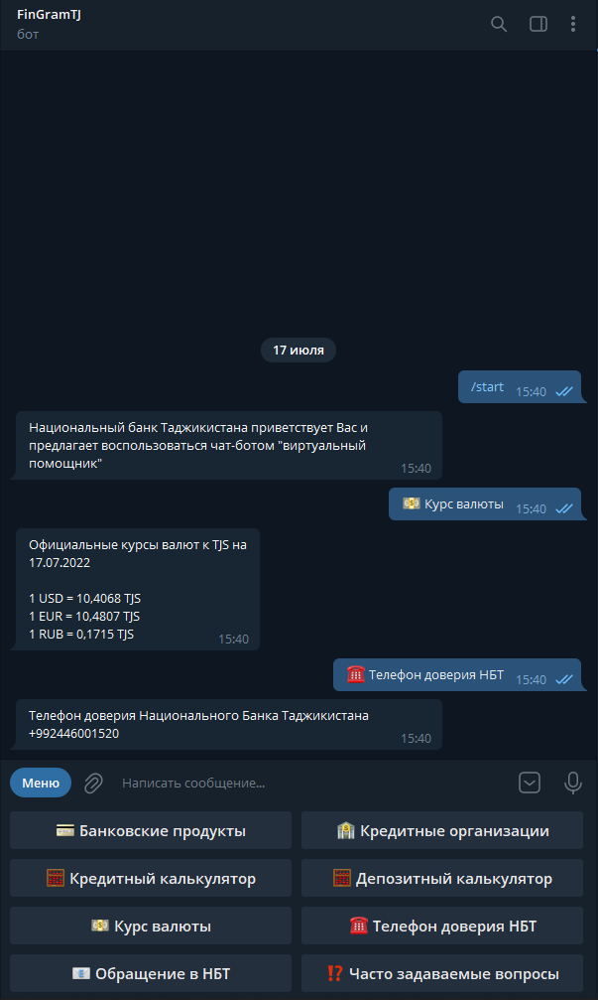
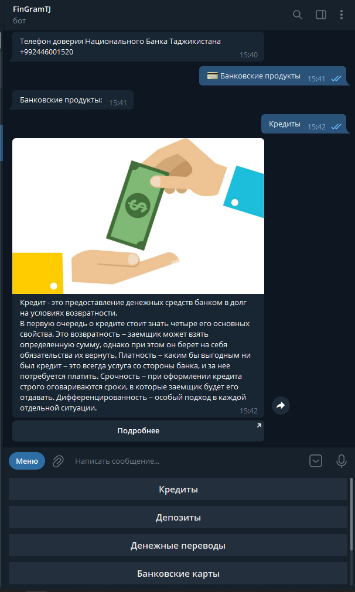
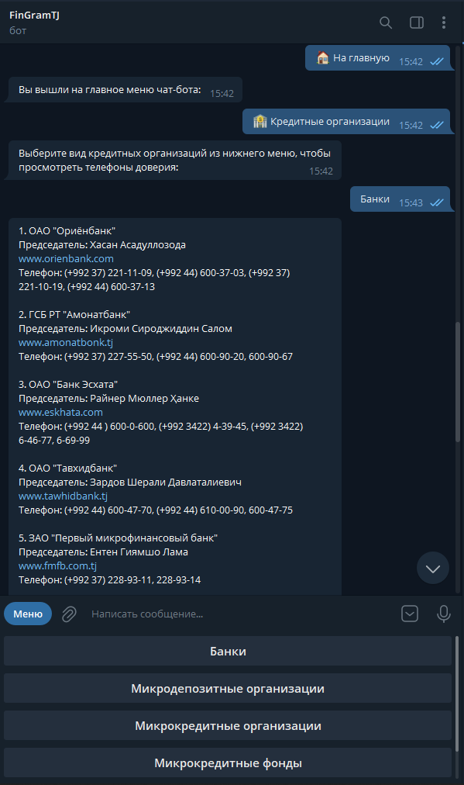
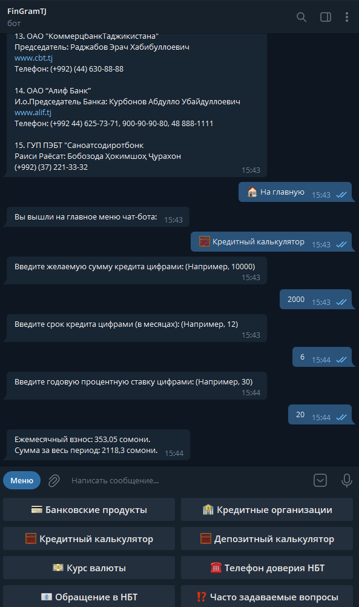

# Telegram bot for NBT
Virtual Assistant of the National Bank of Tajikistan

This bot informs users financially, shows the current exchange rate in Tajikistan, has a loan and deposit calculator, as well as current addresses and phone numbers of all banks in Tajikistan

## Installing
Change _token in [Project.cs](https://github.com/uzzzakov/Telegram-bot-for-NBT/blob/main/Telegram-Bot/Program.cs)
```
        private static string _token = "YOUR_TOKEN_FROM_BOT_FATHER";
```
and email data
```
        private static string admin = "admin_email";
        private static string bot = "bot_email";
        private static string password = "bot_email_password";
```
## Get started
Run the code and wait for the console result "Бот запущен"

## Note
[Docs folder](https://github.com/uzzzakov/Telegram-bot-for-NBT/tree/main/Telegram-Bot/docs) is required, as some answers are taken from files in this directory

## Screenshots
<p align="center">
  
  
  
  
</p>
